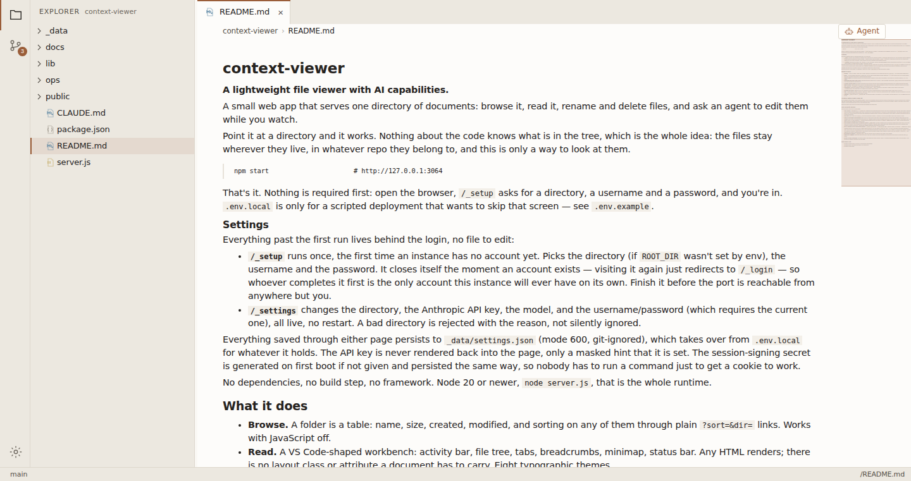

# context-viewer

**A lightweight file viewer with AI capabilities.**

A small web app that serves one directory of documents: browse it, read it,
rename and delete files, and ask an agent to edit them while you watch.



Point it at a directory and it works. Nothing about the code knows what is in
the tree, which is the whole idea: the files stay wherever they live, in
whatever repo they belong to, and this is only a way to look at them.

```bash
npm ci
npm run build
npm start -- -p 3064           # http://127.0.0.1:3064
```

That's it. Nothing is required first: open the browser, `/_ctx/setup` asks for
a directory, a username and a password, and you're in. `.env.local` is only
for a scripted deployment that wants to skip that screen (see `.env.example`).

Node 20 or newer runs the app. The `ops/` scripts import TypeScript directly
and need Node 22.

## Settings

Everything past the first run lives behind the login, no file to edit:

- **`/_ctx/setup`** runs once, the first time an instance has no account yet.
  It picks the directory (if `ROOT_DIR` wasn't set by env), the username, the
  password and, optionally, an SMTP server for security alerts. It closes
  itself the moment an account exists: visiting it again just redirects to
  `/_ctx/login`, so whoever completes it first is the only account this
  instance will ever have. Finish it before the port is reachable from
  anywhere but you.
- **`/_ctx/settings`** changes the directory, the Anthropic API key, the model,
  the alert mail settings and the username or password (which requires the
  current one). All live, no restart. A bad directory is rejected with the
  reason, not silently ignored.

Everything saved through either page persists to `_data/settings.json` (mode
600, git-ignored), which takes over from `.env.local` for whatever it holds.
The API key is never rendered back into the page, only a masked hint that it
is set. The session-signing secret is generated on first boot and persisted
the same way.

## What it does

- **Browse.** A folder is a table: name, size, created, modified, and sorting
  on any of them through plain `?sort=&dir=` links. Works with JavaScript off.
- **Read.** A VS Code-shaped workbench: activity bar, file tree, tabs,
  breadcrumbs, minimap, status bar. Every open adds a tab, and the tabs, the
  tree and the agent's conversation all survive navigation.
- **Documents render as themselves.** An HTML file is served as its own page
  inside an iframe, so its own stylesheet and scripts run and it looks exactly
  as it does when opened directly in a browser, with no way to reach the app
  around it. Markdown goes through a small built-in renderer that escapes raw
  HTML rather than running it.
- **View source.** `?mode=source` shows any file as text with line numbers
  (drawn in CSS, so copying the code does not pick them up). Code files are
  source by default. One file can be open twice, rendered and as source.
- **Themes.** Fifteen workbench colour themes: Paper, this app's own warm
  light theme and the default, plus ports of fourteen of VS Code's. The choice
  is remembered per browser and applied before paint.
- **Components for notes.** `components.css` ships a small set of opt-in
  classes (`ctx-card`, `ctx-tag`, `ctx-callout` and a few more) that follow
  the theme. The reference is the app's own `/_ctx/components` page.
- **Make it yours.** `public/_ctx/assets/viewer.css` is generic and stays that
  way. Drop a `public/custom.css` next to it (git-ignored, absent by default)
  for whatever conventions your own documents use. It loads last and needs no
  restart.
- **Source control.** The sidebar's second view: what changed, commit it,
  push (with a confirmation naming the remote, since that one leaves the
  machine), pull (`--ff-only`), and history.
- **Rename and delete.** Buttons on each listing row, and in the tree's
  context menu (right click, or the row's ⋮). Delete moves the file to a trash
  directory rather than unlinking it.
- **Ask.** An agent with five tools (`list_dir`, `read_file`, `search`,
  `edit_file`, `write_file`) scoped to the root. It streams, and when it edits
  the file you are reading, the document reloads. It cannot delete or rename:
  those are buttons, and the tool list is the enforcement.
- **Alerts.** Optional email on lockouts, sign-ins from a new IP, settings
  changes, account creation and factory resets. Not on a single mistyped
  password.
- **Installable.** Chrome offers to install it as an app. The service worker
  caches nothing, on purpose: a cache is a copy of your documents outside the
  app's control.

## Created dates come from git

The filesystem cannot answer "when was this written". Every file's birthtime is
the day the tree landed on this machine, which for anything older reads as later
than its own mtime. So the created column asks git for the commit that first
added the file, one call per directory, cached. Files from a repo's initial
import all read as that import date, which is the best that exists.

Where the root is not a repo, the column falls back to birthtime and means less.

## The security model

This app writes, so the boring parts matter.

- **One resolver.** `resolveWithin()` in `src/lib/safe.ts` rejects traversal
  and dot-segments (so `.git/` is unreachable) before touching disk, then
  realpaths and proves the result is still inside the root, so a symlink
  cannot escape either. Every read and every write goes through it, including
  all of the agent's tools. **Do not add a second way to open a file**, and do
  not give the agent a tool that takes an absolute path or shells out: that
  property is the reason it is safe to point this at a tree of personal
  documents.
- **One gate.** Every page and endpoint calls `requireSession()` first. Not a
  middleware matcher: a matcher is one careless pattern away from exposing a
  route.
- **Auth is a username and password**, both required, both checked with
  timing-safe compares so a bad username costs the same time as a bad password
  and neither is revealed to be the wrong one. Password hashing is scrypt,
  session cookies are HMAC-SHA256, both on `node:crypto` alone: no session
  library, no auth framework. Five failures lock the account for a while. The
  cookie is `HttpOnly`, `SameSite=Strict` and `__Host-` prefixed.
- **CSRF.** State-changing requests check `Sec-Fetch-Site` first and `Origin`
  as the fallback. A rejection is written to the audit log along with what was
  seen and what was expected.
- **The account is created once, by whoever gets to `/_ctx/setup` first.**
  There is no invite flow and no online recovery, because there is exactly one
  account. Recovery is a local command (below).
- **Every response carries hardening headers**: `X-Content-Type-Options`,
  `X-Frame-Options: DENY`, `Referrer-Policy: same-origin`, `X-Robots-Tag`,
  `Cache-Control: no-store` and a `Content-Security-Policy`. The CSP is strict
  (`script-src 'self'`, no inline) for sign-in, setup, the API and the assets.
  Pages that can show a note relax to `'unsafe-inline'`, because notes carry
  their own styles and scripts, plus an explicit allowlist of script hosts in
  `next.config.ts`. Add a host there only when a note genuinely needs it. The
  document route is the only one that may be framed, and only by the app.
- **Everything is logged** to `_data/audit.jsonl`: sign-ins, failures, every
  file served, every write, every prompt.
- **Writes are commits.** Where the root is a git repo, each edit, rename and
  delete commits, so anything the agent does is recoverable with `git revert`.
- **Delete is trash, not unlink.** The trash directory sits outside the root.
  Inside it, a deleted document would stay in the git history, keep turning up
  in search, and still be one URL away.
- **Email is hand-rolled too** (`src/lib/smtp.ts`), and refuses to send
  credentials in the clear: a server that offers no STARTTLS is refused.

## Configuration

Nothing is required. `.env.example` lists every variable, all optional, for a
deployment that wants to seed settings with no browser involved. Env always
wins over what is saved through the UI. The ones worth knowing:

| Variable | What it does |
| --- | --- |
| `ROOT_DIR` | The directory to serve. |
| `DATA_DIR` | Where settings, the audit log and the trash live. Defaults to `./_data`. |
| `PUBLIC_ORIGIN` | The URL the app is reached at, e.g. `https://notes.example.com`. Makes the origin check independent of proxy headers. |
| `SECURE_COOKIE` | Set to `false` only for plain http on localhost. |
| `GIT_COMMITS` | Set to `false` to stop committing every write. |
| `ANTHROPIC_API_KEY`, `MODEL` | The agent. Also settable in `/_ctx/settings`. |
| `ANTHROPIC_BASE_URL` | Points the agent somewhere else, e.g. a test server. |

Without an API key everything else works and the agent panel says it is not
configured.

## Deploying

`npm start` serves the build, so a deploy is `npm ci && npm run build` before
a restart.

- `ops/context-viewer.service` is a systemd user unit: no sudo, binds to
  `127.0.0.1` only.
- `ops/Caddyfile.block` is a reference Caddy site block. `flush_interval -1`
  is not optional: the agent streams as `text/event-stream`, and a buffering
  proxy delivers the whole answer in one lump at the end.

Keep the app on loopback behind the proxy. The origin check trusts
`X-Forwarded-Host`, which is only safe when the proxy is the one setting it.

## Recovery

Both need the shell account that owns `_data/`. There is deliberately no
online "reset" button: a door that bypasses a login you cannot get past is one
an attacker can open too.

```bash
npm run reset-password   # set a new password
npm run factory-reset    # forget every setting and start again at /_ctx/setup
```

Factory reset backs up `settings.json` first and never touches the documents,
the audit log or the trash.

## Built with

Next.js (App Router), React and TypeScript. The dependency list is `next`,
`react`, `react-dom` and `server-only`. Everything else is hand-rolled on
Node's standard library: password hashing, session cookies, the SMTP client,
the markdown renderer and the agent's tool loop. It is a viewer, not an
editor: no Monaco, no CodeMirror, no syntax highlighting.

```bash
npm run dev         # next dev; set SECURE_COOKIE=false in .env.local for http
npm run typecheck   # tsc --noEmit, expected to be clean
```

## The screenshot

`ops/screenshot.js` takes it, headless, driving Chrome over the DevTools
protocol so it can arrive already signed in. It points at this repo viewing its
own source on purpose: the screenshot of a file browser is a screenshot of
somebody's files, and this one ships publicly.

```bash
node ops/screenshot.js http://127.0.0.1:3064/README.md "$SESSION_COOKIE" docs/screenshot.png
```

## Not done yet

- No search page. The agent can search, you cannot yet.

## License

MIT. See [LICENSE](LICENSE).
